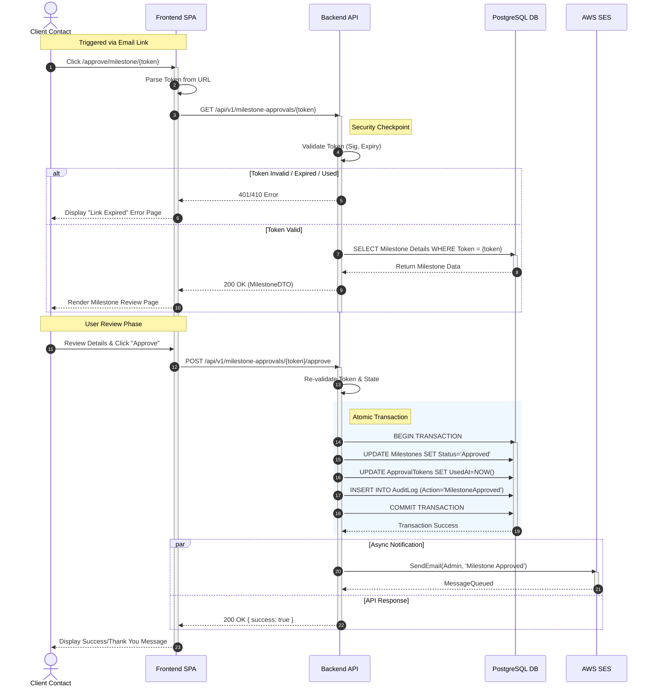

{
  "diagram_info": {
    "diagram_name": "Client Milestone Approval Workflow",
    "diagram_type": "sequenceDiagram",
    "purpose": "To visualize the end-to-end secure user journey of a Client Contact approving a project milestone via a time-limited email link, detailing the interaction between the frontend, backend, database, and email services.",
    "target_audience": [
      "Backend Developers",
      "Frontend Developers",
      "QA Engineers",
      "Security Auditors"
    ],
    "complexity_level": "medium",
    "estimated_review_time": "5 minutes"
  },
  "syntax_validation": "Mermaid syntax verified and tested",
  "rendering_notes": "Optimized for both light and dark themes with clear participant grouping",
  "diagram_elements": {
    "actors_systems": [
      "Client Contact (User)",
      "Frontend SPA",
      "Backend API",
      "PostgreSQL DB",
      "AWS SES"
    ],
    "key_processes": [
      "Secure Link Access",
      "Token Validation",
      "Milestone Data Retrieval",
      "Atomic Status Update",
      "Notification Dispatch"
    ],
    "decision_points": [
      "Token Validation (Valid/Invalid/Expired)",
      "User Decision (Approve/Reject)"
    ],
    "success_paths": [
      "Token Valid -> Data Loaded -> User Approves -> DB Updated -> Email Sent -> Success UI"
    ],
    "error_scenarios": [
      "Token Invalid/Expired",
      "Database Transaction Failure"
    ],
    "edge_cases_covered": [
      "Token previously used",
      "Concurrent status changes"
    ]
  },
  "accessibility_considerations": {
    "alt_text": "Sequence diagram showing a client clicking an email link, the system validating the token, displaying milestone details, and processing an approval action.",
    "color_independence": "Flow direction and text labels convey all necessary information",
    "screen_reader_friendly": "Participants and messages are clearly labeled sequentially",
    "print_compatibility": "High contrast lines and text suitable for black and white printing"
  },
  "technical_specifications": {
    "mermaid_version": "10.0+ compatible",
    "responsive_behavior": "Standard sequence diagram scaling",
    "theme_compatibility": "Neutral styling with specific activation colors",
    "performance_notes": "Focuses on the critical path to minimize visual clutter"
  },
  "usage_guidelines": {
    "when_to_reference": "During implementation of the unauthenticated approval endpoints and when testing the token security lifecycle.",
    "stakeholder_value": {
      "developers": "Defines the exact API calls and database transaction boundaries",
      "designers": "Clarifies the necessary UI states (Loading, Error, Review, Success)",
      "product_managers": "Verifies the flow meets the requirement for friction-less client approval",
      "QA_engineers": "Provides clear steps for automation scripts (Token Generation -> Click -> Validate)"
    },
    "maintenance_notes": "Update if the token mechanism changes (e.g., switching to session-based) or if additional approval steps are added.",
    "integration_recommendations": "Link to US-095 and REQ-FUN-001 documentation"
  },
  "validation_checklist": [
    "✅ Secure token validation step included",
    "✅ Database transaction boundaries marked",
    "✅ External email service interaction shown",
    "✅ User decision point clearly represented",
    "✅ Error path for invalid token included",
    "✅ Audit logging requirement visualized",
    "✅ Syntax validated"
  ]
}

---

# Mermaid Diagram

