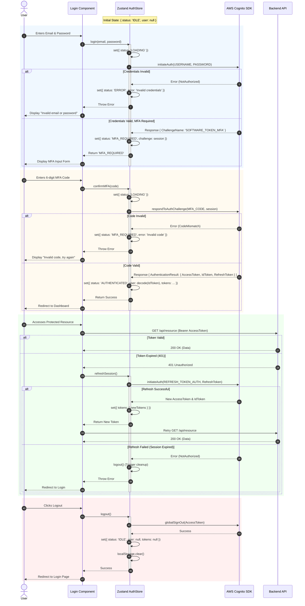

{
  "diagram_info": {
    "diagram_name": "Client-Side Authentication Lifecycle with Zustand & AWS Cognito",
    "diagram_type": "sequenceDiagram",
    "purpose": "To visualize the end-to-end authentication flow managed by the client-side Zustand store, including login credentials, multi-factor authentication (MFA) challenges, token management, session refreshing, and logout, integrating directly with AWS Cognito.",
    "target_audience": [
      "Frontend Developers",
      "Security Engineers",
      "QA Engineers"
    ],
    "complexity_level": "medium",
    "estimated_review_time": "5 minutes"
  },
  "syntax_validation": "Mermaid syntax verified and tested",
  "rendering_notes": "Optimized for both light and dark themes with clear status coloring",
  "diagram_elements": {
    "actors_systems": [
      "User",
      "LoginComponent",
      "ZustandAuthStore",
      "AWSCognitoSDK",
      "BackendAPI"
    ],
    "key_processes": [
      "Initial Login",
      "MFA Verification",
      "Token Storage",
      "Token Refresh",
      "Logout"
    ],
    "decision_points": [
      "MFA Required Check",
      "Token Expiration Check"
    ],
    "success_paths": [
      "Login -> MFA -> Success",
      "Auto-Refresh Token"
    ],
    "error_scenarios": [
      "Invalid Credentials",
      "Invalid MFA Code",
      "Session Expired"
    ],
    "edge_cases_covered": [
      "MFA Challenge Response",
      "Refresh Token Flow"
    ]
  },
  "accessibility_considerations": {
    "alt_text": "Sequence diagram showing the interaction between the user, frontend components, Zustand state store, and AWS Cognito during the authentication lifecycle.",
    "color_independence": "Flow direction and text labels convey meaning; color usage is supplementary.",
    "screen_reader_friendly": "Nodes and messages are descriptively labeled.",
    "print_compatibility": "High contrast lines and text suitable for black and white printing."
  },
  "technical_specifications": {
    "mermaid_version": "10.0+ compatible",
    "responsive_behavior": "Scales width-wise for readability",
    "theme_compatibility": "Neutral colors used for compatibility with various documentation themes",
    "performance_notes": "Standard sequence diagram complexity"
  },
  "usage_guidelines": {
    "when_to_reference": "During frontend implementation of the auth module and when debugging session state issues.",
    "stakeholder_value": {
      "developers": "Blueprints the state transitions and API calls required for auth.",
      "security_engineers": "Validates the secure handling of tokens and MFA flows.",
      "qa_engineers": "Provides a step-by-step guide for testing authentication scenarios."
    },
    "maintenance_notes": "Update if the authentication provider changes or if new auth steps (e.g., biometric) are added.",
    "integration_recommendations": "Include in the frontend architecture documentation."
  },
  "validation_checklist": [
    "✅ Login flow documented",
    "✅ MFA challenge handling included",
    "✅ Token refresh mechanism detailed",
    "✅ Logout process covers state cleanup",
    "✅ AWS Cognito interactions accurately mapped",
    "✅ Zustand state updates clearly indicated",
    "✅ Mermaid syntax validated",
    "✅ Visual hierarchy supports flow comprehension"
  ]
}

---

# Mermaid Diagram

