{
  "diagram_info": {
    "diagram_name": "End-to-End Project Lifecycle Workflow",
    "diagram_type": "flowchart",
    "purpose": "Visualizes the complete operational flow of a project within the Enterprise Mediator Platform, mapping the transition of states from initial creation through SOW processing, vendor selection, financial activation, and milestone execution.",
    "target_audience": [
      "Product Managers",
      "System Architects",
      "Developers",
      "QA Engineers"
    ],
    "complexity_level": "high",
    "estimated_review_time": "10-15 minutes"
  },
  "syntax_validation": "Mermaid syntax verified and tested",
  "rendering_notes": "Optimized for vertical scrolling; uses distinct subgraphs for lifecycle phases.",
  "diagram_elements": {
    "actors_systems": [
      "System Admin",
      "AI Service",
      "Vendor",
      "Client",
      "Finance Manager",
      "System"
    ],
    "key_processes": [
      "SOW Ingestion",
      "Vendor Matching",
      "Proposal Evaluation",
      "Invoicing & Escrow",
      "Milestone Approval"
    ],
    "decision_points": [
      "SOW Review",
      "Vendor Selection",
      "Proposal Acceptance",
      "Milestone Approval"
    ],
    "success_paths": [
      "Happy Path: Create -> Match -> Award -> Pay -> Complete"
    ],
    "error_scenarios": [
      "SOW Processing Failure",
      "Proposal Rejection",
      "Payment Failure",
      "Milestone Rejection"
    ],
    "edge_cases_covered": [
      "Manual Status Overrides",
      "Dispute Resolution (implied via admin actions)"
    ]
  },
  "accessibility_considerations": {
    "alt_text": "Flowchart illustrating the lifecycle of a project from creation by an Admin, through AI-driven SOW analysis, vendor proposal submission, client payment, and final payout execution.",
    "color_independence": "Phases are grouped spatially; shapes distinguish user actions from system processes.",
    "screen_reader_friendly": "Flow follows a logical top-down progression.",
    "print_compatibility": "High contrast borders and text ensure readability in grayscale."
  },
  "technical_specifications": {
    "mermaid_version": "10.0+ compatible",
    "responsive_behavior": "Nodes wrap text for better mobile visibility",
    "theme_compatibility": "Neutral colors used for broad compatibility",
    "performance_notes": "Subgraphs used to organize complexity"
  },
  "usage_guidelines": {
    "when_to_reference": "During integration testing of cross-module workflows or when onboarding new team members to the core business logic.",
    "stakeholder_value": {
      "developers": "Understanding state transitions and inter-service dependencies",
      "designers": "Context for UI states (e.g., read-only vs editable)",
      "product_managers": "Verifying feature completeness across the lifecycle",
      "QA_engineers": "Designing end-to-end regression test suites"
    },
    "maintenance_notes": "Update if new approval steps (e.g., Legal Review) are added to the workflow.",
    "integration_recommendations": "Include in the 'Project Module' architectural documentation."
  },
  "validation_checklist": [
    "✅ SOW Processing loop included",
    "✅ Vendor interaction points mapped",
    "✅ Financial triggers (Invoice/Payout) clearly defined",
    "✅ Role separation (Admin vs Finance) respected",
    "✅ System state transitions accurately labeled",
    "✅ Syntax validated"
  ]
}

---

# Mermaid Diagram

```mermaid
flowchart TD
    %% Define Styles
    classDef actor fill:#e1f5fe,stroke:#01579b,stroke-width:2px,color:#000
    classDef system fill:#f3e5f5,stroke:#4a148c,stroke-width:2px,color:#000
    classDef external fill:#e8f5e9,stroke:#1b5e20,stroke-width:2px,color:#000
    classDef decision fill:#fff9c4,stroke:#fbc02d,stroke-width:2px,color:#000
    classDef state fill:#424242,stroke:#000,stroke-width:2px,color:#fff

    %% Legend
    subgraph Legend
        L1(Internal User Action):::actor
        L2(System/AI Process):::system
        L3(External User Action):::external
        L4{Decision Point}:::decision
        L5([Project State Change]):::state
    end

    %% Phase 1: Definition
    subgraph Phase1 [Phase 1: Project Definition & AI Processing]
        Start((Start)) --> A1(Admin Creates Project):::actor
        A1 --> S1([State: Pending]):::state
        S1 --> A2(Admin Uploads SOW):::actor
        A2 --> Sys1(System Triggers AI Processing):::system
        Sys1 --> D1{AI Processing Success?}:::decision
        
        D1 -- No --> A3(Admin Notified of Failure):::system
        A3 --> A2
        
        D1 -- Yes --> A4(Admin Reviews Extracted Data):::actor
        A4 --> D2{Admin Approves Brief?}:::decision
        D2 -- No / Edit --> A4
        D2 -- Yes --> S2([State: Brief Approved]):::state
    end

    %% Phase 2: Sourcing
    subgraph Phase2 [Phase 2: Vendor Sourcing & Selection]
        S2 --> Sys2(System Generates Vendor Matches):::system
        Sys2 --> A5(Admin Distributes Brief to Vendors):::actor
        A5 --> S3([State: Proposed]):::state
        
        S3 --> V1(Vendor Submits Proposal):::external
        V1 --> A6(Admin Reviews & Compares Proposals):::actor
        
        A6 --> D3{Select Vendor?}:::decision
        D3 -- Reject --> Sys3(System Notifies Rejection):::system
        D3 -- Accept --> S4([State: Awarded]):::state
    end

    %% Phase 3: Activation
    subgraph Phase3 [Phase 3: Contracting & Activation]
        S4 --> A7(Admin Generates Invoice):::actor
        A7 --> C1(Client Receives Invoice Email):::external
        C1 --> C2(Client Pays via Secure Portal):::external
        
        C2 --> Sys4{Payment Success?}:::decision
        Sys4 -- Failed --> C2
        Sys4 -- Success --> Sys5(Funds Held in Escrow):::system
        Sys5 --> S5([State: Active]):::state
    end

    %% Phase 4: Execution
    subgraph Phase4 [Phase 4: Execution & Payouts]
        S5 --> V2(Vendor Completes Milestone Work):::external
        V2 --> C3(Client Approves Milestone):::external
        
        C3 --> D4{Milestone Approved?}:::decision
        D4 -- Rejected --> V2
        D4 -- Approved --> F1(Finance Manager Initiates Payout):::actor
        
        F1 --> F2{Finance Approval?}:::decision
        F2 -- Reject --> F1
        F2 -- Approve --> Sys6(System Releases Escrow to Vendor):::system
        
        Sys6 --> D5{All Milestones Done?}:::decision
        D5 -- No --> V2
        D5 -- Yes --> S6([State: Completed]):::state
    end

    %% Key Links across phases
    Phase1 --> Phase2
    Phase2 --> Phase3
    Phase3 --> Phase4
```

