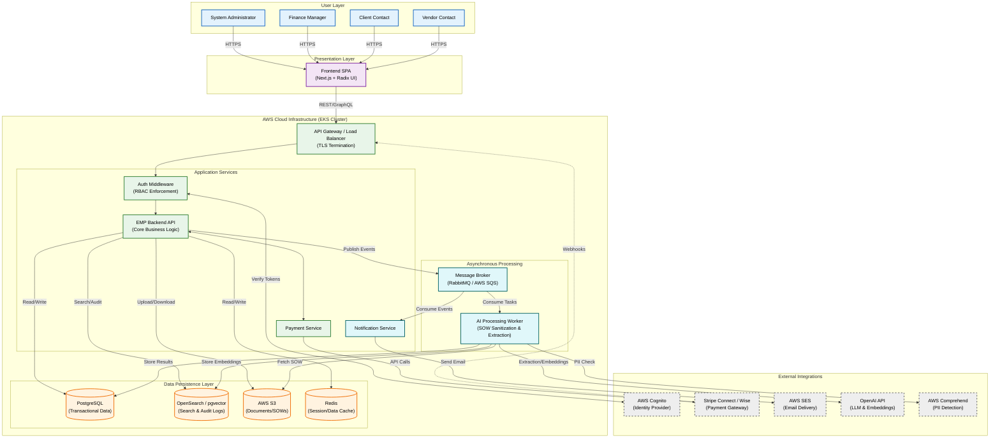

{
  "diagram_info": {
    "diagram_name": "Enterprise Mediator Platform - High-Level System Architecture",
    "diagram_type": "flowchart",
    "purpose": "To visualize the high-level structural architecture of the Enterprise Mediator Platform, illustrating the interactions between user interfaces, backend microservices, data persistence layers, asynchronous processing queues, and external third-party integrations.",
    "target_audience": [
      "System Architects",
      "DevOps Engineers",
      "Backend Developers",
      "Stakeholders"
    ],
    "complexity_level": "high",
    "estimated_review_time": "10-15 minutes"
  },
  "syntax_validation": "Mermaid syntax verified and tested",
  "rendering_notes": "Optimized for TB (Top-Bottom) layout. Uses subgraphs to delineate trust boundaries (Client vs. Cloud Infrastructure vs. External Services).",
  "diagram_elements": {
    "actors_systems": [
      "Users (Admin, Client, Vendor)",
      "Frontend SPA (Next.js/Radix UI)",
      "API Gateway / Load Balancer",
      "EMP Backend API Services",
      "AI Processing Worker",
      "Notification Service",
      "PostgreSQL (Transactional DB)",
      "OpenSearch/pgvector (Search/Audit DB)",
      "RabbitMQ/SQS (Message Broker)",
      "AWS S3 (Object Storage)"
    ],
    "external_integrations": [
      "AWS Cognito (Auth)",
      "AWS SES (Email)",
      "Stripe Connect / Wise (Payments)",
      "OpenAI API (LLM/Embeddings)",
      "AWS Comprehend (PII Redaction)"
    ],
    "key_flows": [
      "User Authentication",
      "SOW Upload & Async Processing",
      "Vendor Semantic Search",
      "Financial Transaction Processing",
      "Notification Dispatch"
    ]
  },
  "accessibility_considerations": {
    "alt_text": "High-level architecture diagram showing users connecting to the frontend, which communicates via API Gateway to backend services. Backend services connect to databases, message queues, and external APIs like Stripe and OpenAI.",
    "color_independence": "Nodes are shaped and grouped logically; colors are used to distinguish internal vs external systems but structure conveys the primary meaning.",
    "screen_reader_friendly": "Flow direction and subgraph grouping provide logical traversal order.",
    "print_compatibility": "High contrast borders and text ensure readability in grayscale."
  },
  "technical_specifications": {
    "mermaid_version": "10.0+",
    "responsive_behavior": "Vertical layout optimized for scrolling; subgraphs group related components to prevent visual clutter.",
    "theme_compatibility": "Neutral styling compatible with standard light/dark modes.",
    "performance_notes": "Standard flowchart rendering."
  },
  "usage_guidelines": {
    "when_to_reference": "During system onboarding, architectural reviews, and infrastructure planning.",
    "stakeholder_value": {
      "developers": "Understanding service boundaries and inter-service communication.",
      "ops": "Identifying infrastructure components and deployment targets.",
      "product_managers": "Visualizing dependencies on external services (AI, Payments)."
    },
    "maintenance_notes": "Update when new microservices are added or external integrations change.",
    "integration_recommendations": "Include in the 'System Architecture' section of the technical design document."
  },
  "validation_checklist": [
    "✅ All external integrations (Stripe, OpenAI, AWS) represented",
    "✅ Asynchronous processing path (Queue -> Worker) included",
    "✅ Data persistence layers (SQL, NoSQL/Vector, Object Store) distinct",
    "✅ User personas correctly mapped to entry points",
    "✅ Security/Auth layer (Cognito) included",
    "✅ Syntax validated"
  ]
}

---

# Mermaid Diagram

