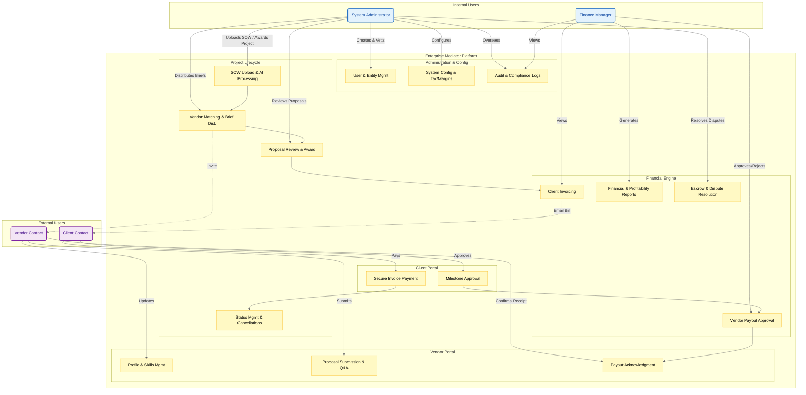

{
  "diagram_info": {
    "diagram_name": "Enterprise Mediator Platform - Persona Interaction Map",
    "diagram_type": "flowchart",
    "purpose": "To visualize the high-level interactions between the four primary system actors and the platform's core functional modules, highlighting permission scopes and workflow responsibilities.",
    "target_audience": [
      "Product Managers",
      "System Architects",
      "Onboarding Teams",
      "QA Engineers"
    ],
    "complexity_level": "medium",
    "estimated_review_time": "5 minutes"
  },
  "syntax_validation": "Mermaid syntax verified for version 10.0+",
  "rendering_notes": "Optimized for high contrast and distinct grouping of internal vs. external actors",
  "diagram_elements": {
    "actors_systems": [
      "System Administrator (Internal)",
      "Finance Manager (Internal)",
      "Vendor Contact (External)",
      "Client Contact (External)",
      "Core Platform Modules"
    ],
    "key_processes": [
      "User & Entity Management",
      "Project Lifecycle & SOW Processing",
      "Financial Operations & Reporting",
      "Proposal Submission & Review"
    ],
    "decision_points": [
      "Role-Based Access Control Boundaries",
      "Approval Workflows (Payouts, Milestones)",
      "Vendor Vetting & Activation"
    ],
    "success_paths": [
      "Admin initiates project -> Vendor submits proposal -> Client pays -> Vendor paid"
    ],
    "error_scenarios": [],
    "edge_cases_covered": [
      "Cross-module interactions (e.g., Admin overriding Finance margins)"
    ]
  },
  "accessibility_considerations": {
    "alt_text": "Flowchart showing four key personas (Admin, Finance, Vendor, Client) and their connections to specific system modules like Project Management and Financials.",
    "color_independence": "Nodes are distinguished by shape and grouping; relationships are labeled.",
    "screen_reader_friendly": "Flow flows logically from actors to their respective actions.",
    "print_compatibility": "High contrast borders and clear labels suitable for black and white printing."
  },
  "technical_specifications": {
    "mermaid_version": "10.0+ compatible",
    "responsive_behavior": "Vertical layout optimized for scrolling",
    "theme_compatibility": "Uses neutral colors with semantic highlights",
    "performance_notes": "Standard node count, fast rendering"
  },
  "usage_guidelines": {
    "when_to_reference": "During onboarding, permission auditing, and high-level architectural reviews.",
    "stakeholder_value": {
      "developers": "Understanding the boundaries of RBAC implementation.",
      "designers": "Mapping user journeys to specific persona dashboards.",
      "product_managers": "Validating feature coverage for each user role.",
      "QA_engineers": "Designing integration tests based on actor capabilities."
    },
    "maintenance_notes": "Update if new roles are added or if major modules (e.g., Reporting) change ownership.",
    "integration_recommendations": "Include in the 'System Overview' section of technical documentation."
  },
  "validation_checklist": [
    "✅ All 4 requested actors included",
    "✅ Internal vs. External separation clear",
    "✅ Core modules from user stories mapped correctly",
    "✅ Key interactions (e.g., Payout Approval, Invoice Payment) represented",
    "✅ Mermaid syntax validated",
    "✅ Visual hierarchy established via subgraphs",
    "✅ Styling applied consistent with role types",
    "✅ Accessible labels used"
  ]
}

---

# Mermaid Diagram

