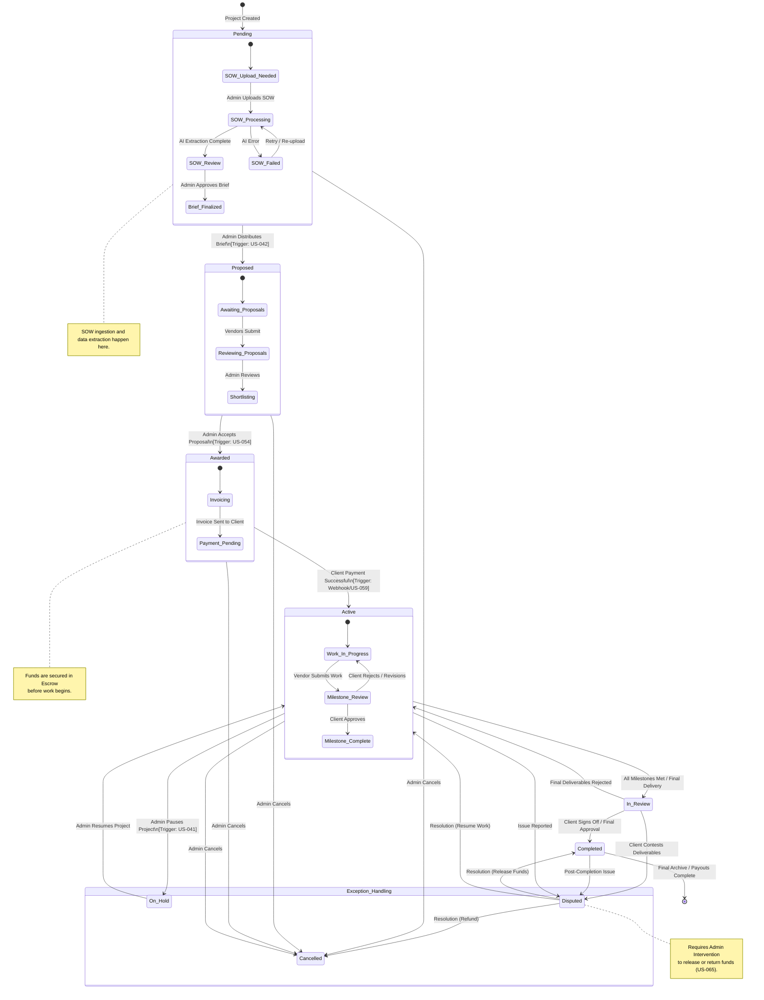

{
  "diagram_info": {
    "diagram_name": "Project Lifecycle State Machine",
    "diagram_type": "stateDiagram",
    "purpose": "To visualize the comprehensive lifecycle of a project within the Enterprise Mediator Platform, detailing all valid state transitions, triggers (user actions or system events), and exception states as defined in the business requirements.",
    "target_audience": [
      "developers",
      "product_managers",
      "QA_engineers",
      "system_administrators"
    ],
    "complexity_level": "medium",
    "estimated_review_time": "5 minutes"
  },
  "syntax_validation": "Mermaid stateDiagram-v2 syntax verified",
  "rendering_notes": "Optimized for vertical flow with clear separation of happy path and exception states",
  "diagram_elements": {
    "actors_systems": [
      "System Admin",
      "Client",
      "Vendor",
      "Payment Gateway",
      "AI Service"
    ],
    "key_processes": [
      "SOW Processing",
      "Proposal Selection",
      "Invoicing",
      "Project Execution",
      "Dispute Resolution"
    ],
    "decision_points": [
      "Brief Approval",
      "Proposal Acceptance",
      "Payment Confirmation",
      "Milestone Approval"
    ],
    "success_paths": [
      "Pending -> Proposed -> Awarded -> Active -> In Review -> Completed"
    ],
    "error_scenarios": [
      "Cancellation",
      "Disputes",
      "Payment Failures"
    ],
    "edge_cases_covered": [
      "Reverting from On Hold",
      "Rejection of deliverables"
    ]
  },
  "accessibility_considerations": {
    "alt_text": "State diagram showing the lifecycle of a project from Pending to Completed, including SOW processing, proposal awarding, active work, and exception states like Cancelled or Disputed.",
    "color_independence": "State transitions are labeled with text triggers; colors used for grouping but not essential for understanding.",
    "screen_reader_friendly": "Flow is directional and logical; labels describe the action required to move between states.",
    "print_compatibility": "High contrast lines and text suitable for black and white printing."
  },
  "technical_specifications": {
    "mermaid_version": "10.0+ compatible",
    "responsive_behavior": "Vertical layout adapts well to documentation pages",
    "theme_compatibility": "Neutral styling works in light and dark modes",
    "performance_notes": "Standard state diagram rendering"
  },
  "usage_guidelines": {
    "when_to_reference": "During implementation of the Project Service state machine logic and when designing UI rules for available actions based on status.",
    "stakeholder_value": {
      "developers": "Defines valid transitions for the state machine implementation.",
      "designers": "Indicates which UI actions (buttons) should be enabled/visible in each state.",
      "product_managers": "Validates the business logic flow and lifecycle stages.",
      "QA_engineers": "Provides a map for testing state transitions and edge cases."
    },
    "maintenance_notes": "Update if new project statuses are added (e.g., 'Archived') or if transition rules change.",
    "integration_recommendations": "Include in the backend Project Service documentation."
  },
  "validation_checklist": [
    "✅ All statuses from US-085 (Pipeline Report) included",
    "✅ SOW processing integration modeled",
    "✅ Financial triggers (Invoice Paid) included",
    "✅ Exception states (Cancelled, Disputed, On Hold) included",
    "✅ Mermaid syntax validated",
    "✅ Clear transition labels"
  ]
}

---

# Mermaid Diagram

