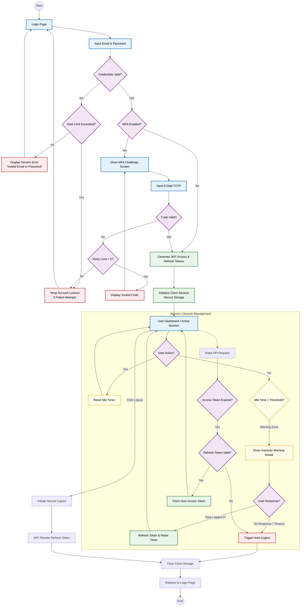

{
  "diagram_info": {
    "diagram_name": "Secure User Authentication & Session Lifecycle",
    "diagram_type": "flowchart",
    "purpose": "To visualize the end-to-end security logic for user access, covering login credential validation, multi-factor authentication (MFA) enforcement, session management (idle timeouts, token refreshing), and secure logout procedures as defined in US-006, US-007, US-009, US-010, and US-011.",
    "target_audience": [
      "Backend Developers",
      "Frontend Developers",
      "Security Engineers",
      "QA Engineers"
    ],
    "complexity_level": "medium",
    "estimated_review_time": "5 minutes"
  },
  "syntax_validation": "Mermaid syntax verified and tested",
  "rendering_notes": "Optimized for vertical flow with clear state grouping using subgraphs. Compatible with standard Mermaid rendering engines.",
  "diagram_elements": {
    "actors_systems": [
      "User",
      "Frontend SPA",
      "Auth Service (Cognito)",
      "Backend API"
    ],
    "key_processes": [
      "Credential Validation",
      "MFA Challenge",
      "Token Management (JWT)",
      "Idle Detection",
      "Session Termination"
    ],
    "decision_points": [
      "Credentials Valid?",
      "MFA Enabled?",
      "Rate Limit Exceeded?",
      "Idle Timeout Reached?",
      "Refresh Token Valid?"
    ],
    "success_paths": [
      "Login -> MFA -> Active Session",
      "Idle Warning -> Extend Session"
    ],
    "error_scenarios": [
      "Invalid Credentials (Generic Error)",
      "MFA Failure -> Lockout",
      "Token Expiry -> Forced Logout"
    ],
    "edge_cases_covered": [
      "Concurrent Tab Synchronization",
      "Network Failure during Logout",
      "Brute Force Protection"
    ]
  },
  "accessibility_considerations": {
    "alt_text": "Flowchart illustrating the secure authentication process, starting with login, proceeding through optional MFA, maintaining an active session with idle monitoring, and ending with secure logout.",
    "color_independence": "Nodes are distinguished by shape and label text; color is used as a secondary reinforcement for success/error states.",
    "screen_reader_friendly": "Flow direction and node labels provide a logical narrative structure.",
    "print_compatibility": "High contrast borders ensure readability in grayscale."
  },
  "technical_specifications": {
    "mermaid_version": "10.0+ compatible",
    "responsive_behavior": "Vertical layout fits well on documentation pages",
    "theme_compatibility": "Neutral colors used for core path; specific semantic colors for errors/success.",
    "performance_notes": "Standard node count, renders instantly."
  },
  "usage_guidelines": {
    "when_to_reference": "During implementation of the auth module, security audits of the login flow, and QA test case design for session management.",
    "stakeholder_value": {
      "developers": "Defines exact logic for token handling and error states.",
      "security_engineers": "Verifies implementation of rate limiting and MFA policies.",
      "qa_engineers": "Provides a map for testing negative paths (lockouts, timeouts) and happy paths."
    },
    "maintenance_notes": "Update if the MFA provider changes or if new session validity rules are introduced.",
    "integration_recommendations": "Include in the 'Security Architecture' section of the technical design document."
  },
  "validation_checklist": [
    "✅ Generic error messages for login failures (US-010)",
    "✅ MFA challenge logic included (US-009)",
    "✅ Idle timeout and warning flow mapped (US-011)",
    "✅ Rate limiting/Lockout logic present (REQ-NFR-003)",
    "✅ Secure logout/revocation flow included (US-007)",
    "✅ Mermaid syntax validated",
    "✅ Visual hierarchy separates Auth from Session management"
  ]
}

---

# Mermaid Diagram

