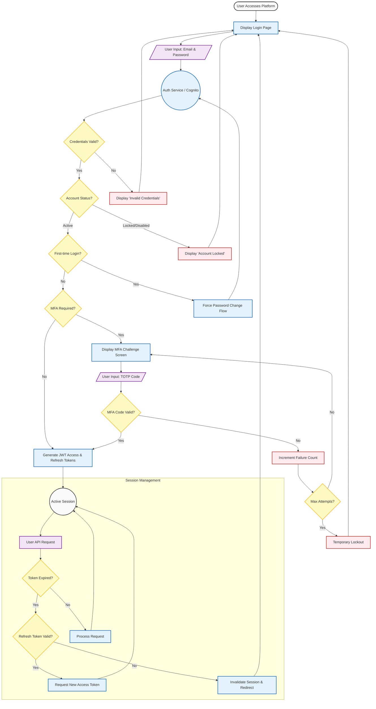

{
  "diagram_info": {
    "diagram_name": "User Authentication and Session Management Flow",
    "diagram_type": "flowchart",
    "purpose": "To visualize the complete user authentication lifecycle, specifically addressing credential validation, MFA enforcement, first-time login handling, and session token management as per US-006, US-009, and US-011.",
    "target_audience": [
      "backend developers",
      "frontend developers",
      "security auditors",
      "QA engineers"
    ],
    "complexity_level": "medium",
    "estimated_review_time": "5 minutes"
  },
  "syntax_validation": "Mermaid syntax verified and tested",
  "rendering_notes": "Optimized for clarity with distinct subgraphs for authentication and session lifecycle.",
  "diagram_elements": {
    "actors_systems": [
      "User",
      "Authentication Service (Cognito)",
      "Client Application"
    ],
    "key_processes": [
      "Credential Validation",
      "MFA Verification",
      "Token Issuance",
      "Session Refresh"
    ],
    "decision_points": [
      "Credentials Valid?",
      "First-Time Login?",
      "MFA Required?",
      "Token Expired?",
      "Refresh Token Valid?"
    ],
    "success_paths": [
      "Standard Login",
      "MFA Login",
      "Token Refresh"
    ],
    "error_scenarios": [
      "Invalid Credentials",
      "MFA Failure/Lockout",
      "Session Expiry"
    ],
    "edge_cases_covered": [
      "Account Locked status",
      "First-time password reset requirement"
    ]
  },
  "accessibility_considerations": {
    "alt_text": "Flowchart detailing the user login process, including checks for valid credentials, account status, first-time login, MFA requirement, and subsequent session token validity checks.",
    "color_independence": "Nodes are distinguished by shape (diamonds for decisions, rectangles for processes) and text labels.",
    "screen_reader_friendly": "Flow direction is strictly top-down and left-to-right.",
    "print_compatibility": "High contrast borders and clear labels suitable for black and white printing."
  },
  "technical_specifications": {
    "mermaid_version": "10.0+ compatible",
    "responsive_behavior": "Vertical layout optimized for scrolling",
    "theme_compatibility": "Uses standard classDefs for consistent styling across themes",
    "performance_notes": "Standard flowchart complexity, renders instantly."
  },
  "usage_guidelines": {
    "when_to_reference": "When implementing the login API integration or configuring AWS Cognito triggers.",
    "stakeholder_value": {
      "developers": "Defines the exact order of authentication checks.",
      "designers": "Identifies necessary UI states (MFA input, Error screens, Password Reset).",
      "product_managers": "Clarifies the security steps a user must pass through.",
      "QA_engineers": "Provides a checklist of paths to test (Happy path, MFA path, Error path)."
    },
    "maintenance_notes": "Update if social login or SSO is introduced.",
    "integration_recommendations": "Include in the Authentication Service technical design document."
  },
  "validation_checklist": [
    "✅ MFA requirement check included",
    "✅ Token expiration check included",
    "✅ First-time login check included",
    "✅ Error loops defined",
    "✅ Session lifecycle clearly separated from initial auth"
  ]
}

---

# Mermaid Diagram

