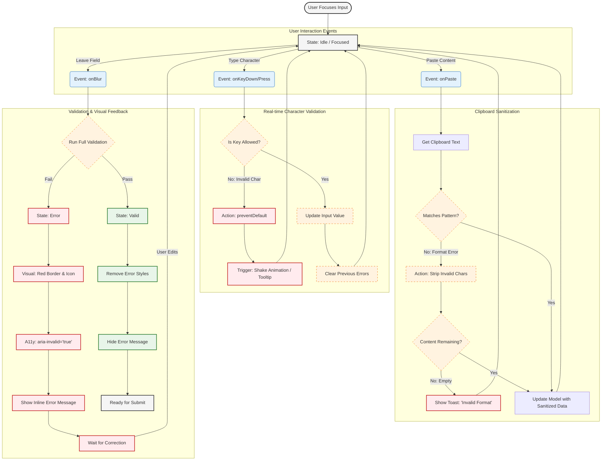

{
  "diagram_info": {
    "diagram_name": "Client-Side Input Validation State Machine",
    "diagram_type": "flowchart",
    "purpose": "Documents the detailed interaction logic for secure form inputs (e.g., Project Cost, ID numbers) including character-level filtering, paste sanitization, and visual error feedback states.",
    "target_audience": [
      "Frontend Developers",
      "QA Engineers",
      "UX Designers"
    ],
    "complexity_level": "medium",
    "estimated_review_time": "5 minutes"
  },
  "diagram_elements": {
    "actors_systems": [
      "User",
      "Input Component",
      "Validation Engine",
      "UI State Manager"
    ],
    "key_processes": [
      "Keystroke Filtering",
      "Paste Sanitization",
      "Blur Validation",
      "Error State Rendering"
    ],
    "decision_points": [
      "Is Character Valid?",
      "Is Paste Content Valid?",
      "Is Field Required?"
    ],
    "success_paths": [
      "Valid character entry",
      "Clean paste operation",
      "Successful validation on blur"
    ],
    "error_scenarios": [
      "Invalid character rejected",
      "Paste format mismatch",
      "Validation failure state"
    ],
    "edge_cases_covered": [
      "Non-numeric characters",
      "Formatted content pasting",
      "Empty required fields"
    ]
  },
  "accessibility_considerations": {
    "alt_text": "Flowchart describing input validation logic: keystrokes are filtered instantly, paste events are sanitized, and invalid states trigger visual and ARIA feedback.",
    "color_independence": "States are distinguished by shape and label, not just color.",
    "screen_reader_friendly": "Includes ARIA-live region updates in the error flow.",
    "print_compatibility": "High contrast rendering suitable for black and white printing."
  },
  "technical_specifications": {
    "mermaid_version": "10.0+",
    "responsive_behavior": "Vertical layout optimized for scrolling",
    "theme_compatibility": "Neutral styling compatible with light/dark modes",
    "performance_notes": "Logic represents synchronous client-side events ( < 16ms)"
  },
  "usage_guidelines": {
    "when_to_reference": "When implementing custom form controls (e.g., CurrencyInput, PhoneInput) requiring strict formatting.",
    "stakeholder_value": {
      "developers": "Exact logic for event handlers (onKeyDown, onPaste, onBlur).",
      "designers": "Definition of visual error states and feedback timing.",
      "product_managers": "Understanding of data integrity enforcement at the source.",
      "qa_engineers": "Test cases for invalid inputs and clipboard operations."
    },
    "maintenance_notes": "Update if validation libraries (e.g., Zod, Yup) change or if new input types are added.",
    "integration_recommendations": "Link to the Design System 'Form Pattern' documentation."
  },
  "validation_checklist": [
    "✅ Invalid character entry path documented",
    "✅ Paste format error logic included",
    "✅ Validation failure visual state clearly defined",
    "✅ Recovery path (correction) included",
    "✅ Accessibility triggers (ARIA) marked",
    "✅ Syntax is valid Mermaid",
    "✅ Visual hierarchy flows logically from user action to system response"
  ]
}

---

# Mermaid Diagram

