{
  "diagram_info": {
    "diagram_name": "EMP User Interaction & Responsibility Map",
    "diagram_type": "flowchart",
    "purpose": "To visualize the primary interactions of all user personas with the core system modules, providing a high-level overview of role-based capabilities and system entry points.",
    "target_audience": [
      "product managers",
      "developers",
      "QA engineers",
      "stakeholders"
    ],
    "complexity_level": "medium",
    "estimated_review_time": "5 minutes"
  },
  "diagram_elements": {
    "actors_systems": [
      "System Administrator",
      "Finance Manager",
      "Client Contact",
      "Vendor Contact",
      "EMP Core Platform"
    ],
    "key_processes": [
      "User Onboarding",
      "Project Initiation",
      "Proposal Submission",
      "Financial Approvals",
      "Payment Processing"
    ],
    "decision_points": [
      "Role-Based Access Control",
      "Approval Workflows"
    ],
    "success_paths": [
      "Admin -> Project Creation",
      "Vendor -> Proposal Submission",
      "Client -> Invoice Payment",
      "Finance -> Payout Approval"
    ],
    "error_scenarios": [
      "Unauthorized Access Attempts"
    ],
    "edge_cases_covered": [
      "Cross-role interactions"
    ]
  },
  "accessibility_considerations": {
    "alt_text": "Flowchart displaying the four key user roles (System Admin, Finance Manager, Client, Vendor) and their distinct interaction paths with system modules like Entity Management, Project Lifecycle, and Financial Operations.",
    "color_independence": "Nodes are distinguished by shape and grouping; color provides secondary visual reinforcement.",
    "screen_reader_friendly": "All text labels describe the specific action being performed.",
    "print_compatibility": "High contrast layout suitable for grayscale printing."
  },
  "technical_specifications": {
    "mermaid_version": "10.0+",
    "responsive_behavior": "Vertical layout optimized for scrolling; subgraphs group related logic.",
    "theme_compatibility": "Uses class definitions for consistent styling across light/dark modes.",
    "performance_notes": "Standard flowchart complexity; renders efficiently."
  },
  "usage_guidelines": {
    "when_to_reference": "During onboarding of new team members, sprint planning to identify role dependencies, and RBAC testing.",
    "stakeholder_value": {
      "developers": "Clarifies auth scopes and API endpoints needed per role",
      "designers": "Maps out necessary dashboards and navigation structures per persona",
      "product_managers": "Validates feature coverage for all user types",
      "QA_engineers": "Provides a checklist for role-based test scenarios"
    },
    "maintenance_notes": "Update if new roles are added or if major responsibilities shift between Admin and Finance.",
    "integration_recommendations": "Include in the 'Architecture Overview' or 'User Roles' section of technical documentation."
  },
  "validation_checklist": [
    "✅ All 4 defined user personas are represented",
    "✅ Key workflows from User Stories are mapped to actors",
    "✅ Internal vs External users are visually distinguished",
    "✅ Core modules (Financials, Projects, Entities) are represented",
    "✅ Directionality follows the logical flow of actions",
    "✅ Syntax is valid Mermaid flowchart"
  ]
}

---

# Mermaid Diagram

```mermaid
flowchart TD
    %% Define Styles
    classDef internalUser fill:#e3f2fd,stroke:#1565c0,stroke-width:2px,color:#0d47a1
    classDef externalUser fill:#fff3e0,stroke:#e65100,stroke-width:2px,color:#e65100
    classDef module fill:#f3e5f5,stroke:#4a148c,stroke-width:2px,color:#4a148c
    classDef action fill:#ffffff,stroke:#546e7a,stroke-width:1px,color:#37474f,stroke-dasharray: 5 5

    %% Actors
    subgraph Internal_Users [Internal Users]
        Admin((System Administrator)):::internalUser
        Finance((Finance Manager)):::internalUser
    end

    subgraph External_Users [External Users]
        Client((Client Contact)):::externalUser
        Vendor((Vendor Contact)):::externalUser
    end

    %% Core System Modules
    subgraph EMP_System [Enterprise Mediator Platform]
        direction TB
        
        subgraph Mod_Entity [Entity & User Management]
            M1[Invite Users & Contacts]
            M2[Manage Client/Vendor Profiles]
            M3[Config System Settings]
        end

        subgraph Mod_Project [Project Lifecycle]
            P1[Create Project]
            P2[Upload & Process SOW]
            P3[Distribute Project Brief]
            P4[Award Project / Status Change]
        end

        subgraph Mod_Proposal [Proposal Portal]
            R1[View Project Brief]
            R2[Submit Proposal]
            R3[Project Q&A]
            R4[Review & Score Proposals]
        end

        subgraph Mod_Finance [Financial Management]
            F1[Generate Client Invoice]
            F2[Process Client Payment]
            F3[Initiate & Approve Payouts]
            F4[Financial Reports & Ledger]
            F5[Dispute Resolution]
        end
    end

    %% Relationships - System Admin
    Admin -->|Invites| M1
    Admin -->|Manages| M2
    Admin -->|Configures| M3
    Admin -->|Initiates| P1
    Admin -->|Uploads| P2
    Admin -->|Distributes| P3
    Admin -->|Evaluates| R4
    Admin -->|Awards| P4
    Admin -->|Triggers Invoice| F1
    Admin -->|Resolves| F5

    %% Relationships - Finance Manager
    Finance -->|Views| M2
    Finance -->|Reviews| P4
    Finance -->|Approves| F3
    Finance -->|Views| F4
    Finance -->|Configures Margin| M3

    %% Relationships - Vendor
    Vendor -->|Registers via| M1
    Vendor -->|Updates Profile| M2
    Vendor -->|Accesses| R1
    Vendor -->|Submits| R2
    Vendor -->|Asks Questions| R3
    Vendor -->|Acknowledges Receipt| F3

    %% Relationships - Client
    Client -->|Registers via| M1
    Client -->|Pays| F2
    Client -->|Approves Milestones| P4
    Client -->|Refunded via| F5

    %% Module Inter-dependencies (High Level)
    M1 -.->|Creates Account| Mod_Entity
    P2 -.->|Generates Data| P3
    P3 -.->|Invites Vendor| R1
    R2 -.->|Basis for| R4
    P4 -.->|Triggers| F1
    F2 -.->|Activates Project| Mod_Project
    F1 -.->|Sent to| Client
    F3 -.->|Sent to| Vendor

    %% Apply Styles to Modules
    class M1,M2,M3,P1,P2,P3,P4,R1,R2,R3,R4,F1,F2,F3,F4,F5 module
```

