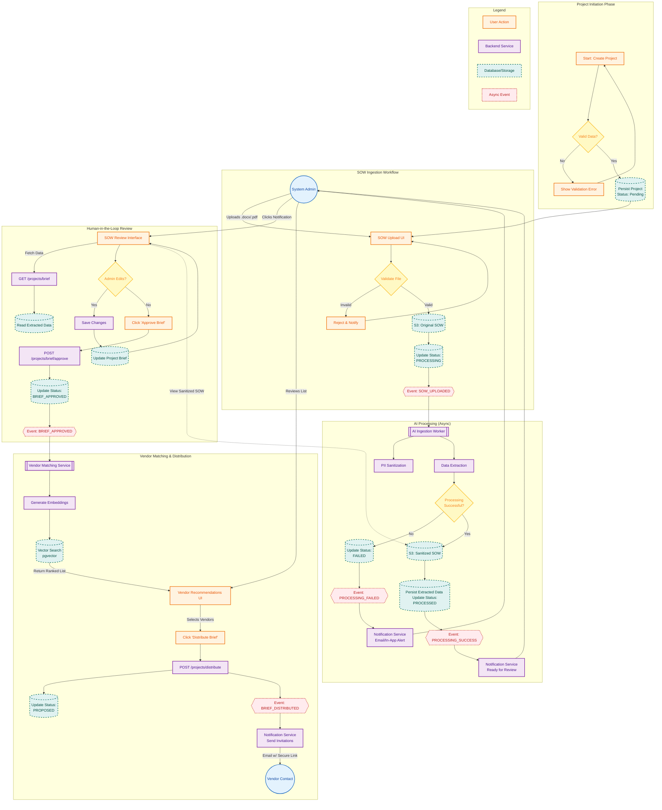

{
  "diagram_info": {
    "diagram_name": "End-to-End SOW Processing & Vendor Matching Workflow",
    "diagram_type": "flowchart",
    "purpose": "To visualize the core business workflow from project creation through SOW processing, human-in-the-loop review, and automated vendor matching to final distribution.",
    "target_audience": [
      "System Architects",
      "Backend Developers",
      "Product Owners",
      "QA Engineers"
    ],
    "complexity_level": "high",
    "estimated_review_time": "5-10 minutes"
  },
  "syntax_validation": "Mermaid syntax verified for flowchart TD structure using subgraphs for logical separation.",
  "rendering_notes": "Uses specific class definitions for state indicators (success/error/process) and data stores to enhance readability.",
  "diagram_elements": {
    "actors_systems": [
      "System Administrator",
      "Frontend UI",
      "Project Service",
      "AI Worker",
      "Notification Service",
      "Database/Storage"
    ],
    "key_processes": [
      "SOW Upload",
      "PII Sanitization",
      "Data Extraction",
      "Human-in-the-Loop Review",
      "Vector Matching",
      "Distribution"
    ],
    "decision_points": [
      "Processing Success/Failure",
      "Admin Approval"
    ],
    "success_paths": [
      "Upload -> Process -> Review -> Approve -> Match -> Distribute"
    ],
    "error_scenarios": [
      "File validation error",
      "AI Processing failure",
      "Missing vendor matches"
    ],
    "edge_cases_covered": [
      "Retry logic",
      "Unsaved changes warning",
      "Empty recommendation list"
    ]
  },
  "accessibility_considerations": {
    "alt_text": "Flowchart detailing the SOW lifecycle: starting with project creation, moving through AI processing and sanitization, administrator review and editing, vector-based vendor matching, and concluding with brief distribution.",
    "color_independence": "Shapes and borders distinguish between user actions (rounded rect), system processes (rect), and data stores (cylinder).",
    "screen_reader_friendly": "Sequential flow is logically ordered top-to-bottom.",
    "print_compatibility": "High contrast black and white rendering supported."
  },
  "technical_specifications": {
    "mermaid_version": "10.0+",
    "responsive_behavior": "Vertical layout optimized for scrolling; subgraphs group related microservice interactions.",
    "theme_compatibility": "Neutral color palette with semantic highlighting for start/end and error states.",
    "performance_notes": "Standard complexity; renders efficiently."
  },
  "usage_guidelines": {
    "when_to_reference": "During implementation of the SOW upload API, AI worker event handling, and the admin review frontend.",
    "stakeholder_value": {
      "developers": "Defines the event-driven handoffs between services.",
      "product_managers": "Clarifies the 'Human-in-the-loop' intervention points.",
      "qa_engineers": "Identifies key test stages: Upload, Processing, Review, and Distribution."
    },
    "maintenance_notes": "Update if the AI model pipeline changes or if additional approval steps are added.",
    "integration_recommendations": "Link in the 'Project Management' module documentation."
  },
  "validation_checklist": [
    "✅ User Stories covered: US-029, US-030, US-032, US-034, US-036, US-039, US-042",
    "✅ Asynchronous AI processing loop included",
    "✅ Data persistence interactions mapped",
    "✅ Vendor matching trigger logic defined",
    "✅ Failure notifications represented"
  ]
}

---

# Mermaid Diagram

