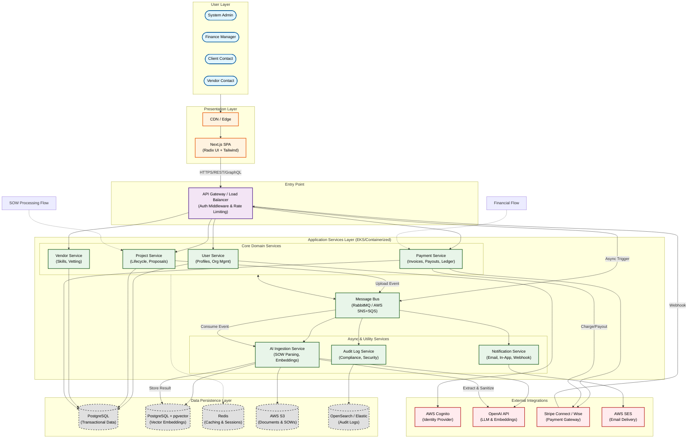

{
  "diagram_info": {
    "diagram_name": "Enterprise Mediator Platform - High-Level System Architecture",
    "diagram_type": "flowchart",
    "purpose": "To provide a comprehensive architectural overview of the Enterprise Mediator Platform, illustrating the interaction between user personas, the frontend application, backend microservices, data storage, and external integrations.",
    "target_audience": [
      "System Architects",
      "Lead Developers",
      "Stakeholders",
      "DevOps Engineers"
    ],
    "complexity_level": "high",
    "estimated_review_time": "10-15 minutes"
  },
  "diagram_elements": {
    "actors_systems": [
      "System Administrator",
      "Finance Manager",
      "Client Contact",
      "Vendor Contact",
      "Next.js Frontend",
      "API Gateway",
      "Core Services (Project, Vendor, Finance, User)",
      "Specialized Services (AI Ingestion, Notification)",
      "Data Stores (PostgreSQL, Redis, S3)",
      "External Integrations (Stripe, OpenAI, AWS SES, Cognito)"
    ],
    "key_processes": [
      "User Authentication & RBAC",
      "SOW Upload & AI Processing",
      "Vendor Matching via Vector Search",
      "Proposal Submission & Management",
      "Financial Transactions (Invoicing/Payouts)",
      "Audit Logging"
    ],
    "decision_points": [
      "Auth Validation",
      "Role-Based Access Control",
      "SOW Processing Success/Failure",
      "Payment Gateway Response"
    ],
    "success_paths": [
      "End-to-end Project Lifecycle",
      "Secure Payment Processing",
      "Automated Vendor Matching"
    ],
    "error_scenarios": [
      "External API Failures",
      "AI Processing Errors",
      "Payment Declines"
    ],
    "edge_cases_covered": [
      "Asynchronous processing delays",
      "Service isolation"
    ]
  },
  "accessibility_considerations": {
    "alt_text": "High-level architecture diagram showing users connecting to a React frontend, which communicates via an API Gateway to backend microservices. Key services include Project, Vendor, Finance, and AI Ingestion. Data is stored in PostgreSQL and S3. External integrations include Stripe, OpenAI, and AWS SES.",
    "color_independence": "Nodes are distinguished by shape and grouping (subgraphs) in addition to color styling.",
    "screen_reader_friendly": "Flow hierarchy is logical: Users -> Frontend -> Gateway -> Services -> Data/External.",
    "print_compatibility": "High contrast lines and text ensure readability in grayscale."
  },
  "technical_specifications": {
    "mermaid_version": "10.0+",
    "responsive_behavior": "Vertical layout (TB) optimized for scrolling on standard screens.",
    "theme_compatibility": "Neutral styling compatible with light and dark modes.",
    "performance_notes": "Uses subgraphs to cluster related components for faster cognitive processing."
  },
  "usage_guidelines": {
    "when_to_reference": "During onboarding, architectural reviews, and when planning cross-service features.",
    "stakeholder_value": {
      "developers": "Understanding service boundaries and data flow.",
      "designers": "Contextualizing where UI interactions trigger backend processes.",
      "product_managers": "Visualizing external dependencies and system capabilities.",
      "qa_engineers": "Identifying integration testing points."
    },
    "maintenance_notes": "Update when new microservices are added or external integrations change.",
    "integration_recommendations": "Include in the system README and architectural design document (ADD)."
  },
  "validation_checklist": [
    "✅ All user personas included",
    "✅ Frontend and Backend separation clear",
    "✅ Critical external integrations (Stripe, OpenAI) mapped",
    "✅ Data storage layers defined",
    "✅ Mermaid syntax validated",
    "✅ Logical flow from User to Data"
  ]
}

---

# Mermaid Diagram

