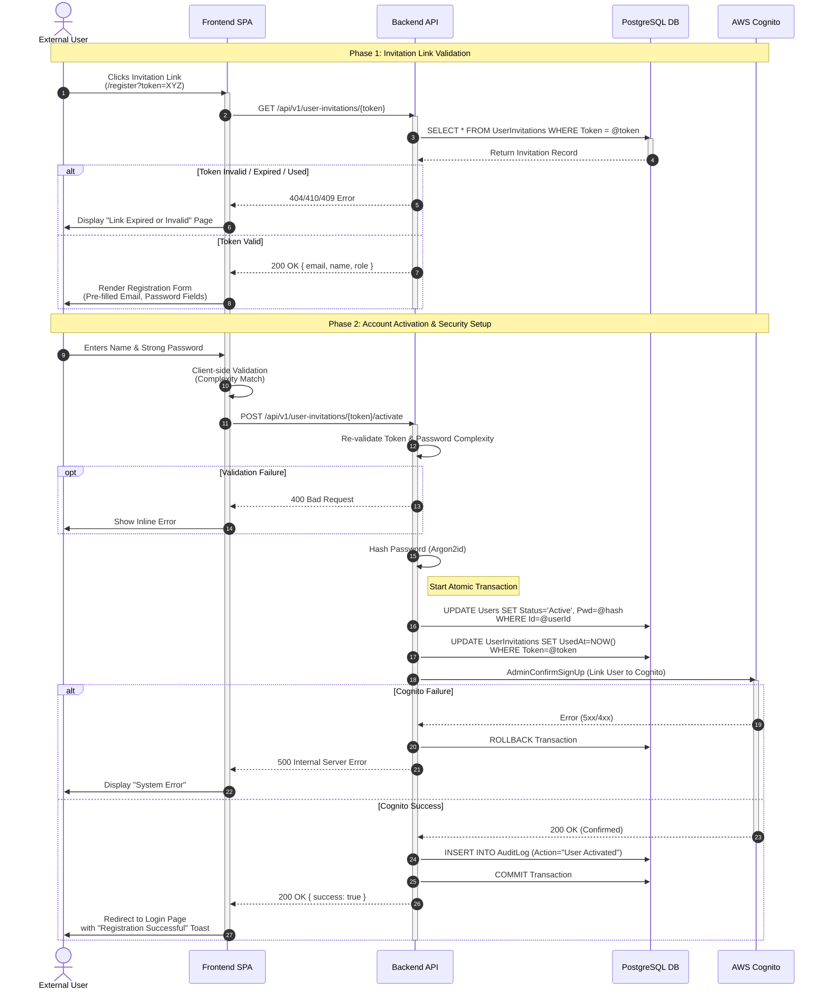

{
  "diagram_info": {
    "diagram_name": "Invited User Registration & Activation Sequence",
    "diagram_type": "sequenceDiagram",
    "purpose": "Technical visualization of the user onboarding process via secure invitation link, detailing the interaction between the user, frontend, backend services, and external identity providers as defined in US-004 and Sequence Design ID 474.",
    "target_audience": [
      "Backend Developers",
      "Frontend Developers",
      "Security Architects",
      "QA Engineers"
    ],
    "complexity_level": "medium",
    "estimated_review_time": "5-8 minutes"
  },
  "syntax_validation": "Mermaid syntax verified and tested for Sequence Diagram strict mode",
  "rendering_notes": "Uses auto-numbering for step clarity and notes for specific security requirements like Argon2id hashing and atomic transactions.",
  "diagram_elements": {
    "actors_systems": [
      "External User",
      "Frontend SPA",
      "Backend API",
      "PostgreSQL DB",
      "AWS Cognito"
    ],
    "key_processes": [
      "Token Validation",
      "Password Complexity Check",
      "Password Hashing (Argon2id)",
      "Account Activation",
      "Identity Provider Confirmation"
    ],
    "decision_points": [
      "Token Validity Check",
      "Password Policy Check",
      "Cognito Integration Success"
    ],
    "success_paths": [
      "User clicks link -> Token Validated -> Form Submitted -> Account Activated -> Redirect to Login"
    ],
    "error_scenarios": [
      "Token Expired (410)",
      "Token Invalid (404)",
      "Token Already Used (409)",
      "Weak Password",
      "Cognito Failure"
    ],
    "edge_cases_covered": [
      "Database rollback on Cognito failure",
      "Re-validation of token on submit"
    ]
  },
  "accessibility_considerations": {
    "alt_text": "Sequence diagram showing the flow of a user registering via an invitation link. It moves from the user clicking a link, to the frontend validating the token with the backend, submitting the registration form, and the backend coordinating with the database and AWS Cognito to finalize the account.",
    "color_independence": "Success and failure paths are textually distinguished in notes and alt blocks",
    "screen_reader_friendly": "Sequential ordering logically follows the time-based interaction",
    "print_compatibility": "High contrast lines and text ensure readability in grayscale"
  },
  "technical_specifications": {
    "mermaid_version": "10.0+ compatible",
    "responsive_behavior": "Horizontal scrolling required on mobile due to participant width",
    "theme_compatibility": "Neutral colors used for compatibility with light/dark modes",
    "performance_notes": "Standard rendering complexity"
  },
  "usage_guidelines": {
    "when_to_reference": "During implementation of the 'POST /activate' endpoint and the registration frontend page.",
    "stakeholder_value": {
      "developers": "Defines the exact API contract and transactional boundaries.",
      "designers": "Highlights necessary UI states (Loading, Error, Success).",
      "product_managers": "Verifies the security and compliance steps (Audit logging, MFA setup readiness).",
      "QA_engineers": "Provides a blueprint for integration tests (Token expiry, DB rollback scenarios)."
    },
    "maintenance_notes": "Update if the identity provider changes or if additional onboarding steps (e.g., TOS acceptance) are added.",
    "integration_recommendations": "Link to US-004 and the API Specification for '/api/v1/user-invitations'."
  },
  "validation_checklist": [
    "✅ Security requirement (Argon2id) explicitly noted",
    "✅ Atomic transaction boundaries defined",
    "✅ Edge cases (Expired/Used tokens) handled via Alt blocks",
    "✅ Integration with AWS Cognito included",
    "✅ Audit logging step included as per REQ-FUN-005",
    "✅ Frontend/Backend separation clear",
    "✅ User feedback loops (Success/Error) visualized"
  ]
}

---

# Mermaid Diagram

