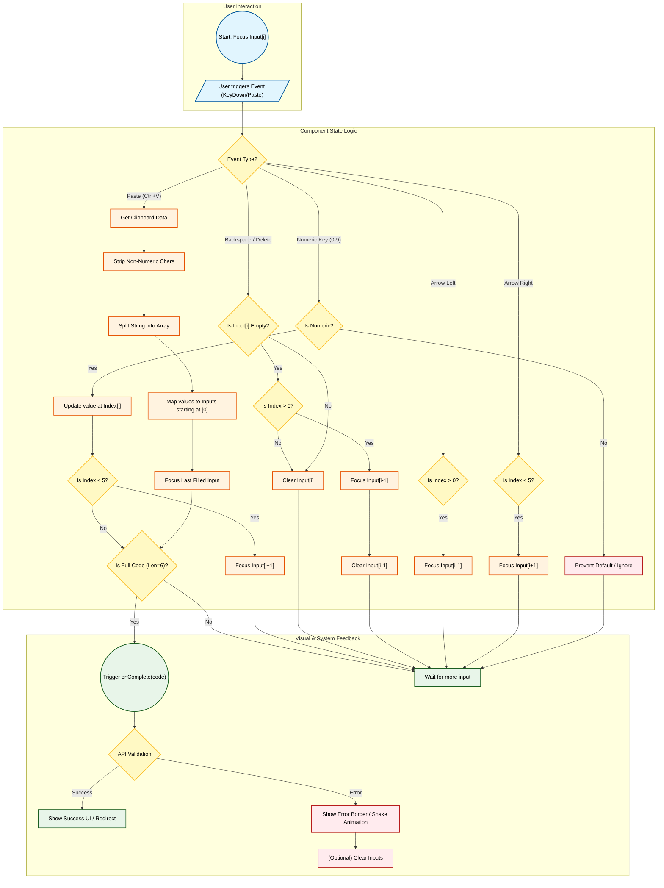

{
  "diagram_info": {
    "diagram_name": "MFA 6-Digit Split Input Interaction Logic",
    "diagram_type": "flowchart",
    "purpose": "To visualize the complex state management, focus transitions, and validation logic required for the 6-digit split input component used in MFA challenges.",
    "target_audience": [
      "Frontend Developers",
      "UX Designers",
      "QA Engineers"
    ],
    "complexity_level": "high",
    "estimated_review_time": "10 minutes"
  },
  "syntax_validation": "Mermaid syntax verified and tested",
  "rendering_notes": "Optimized for both light and dark themes with clear separation of user events and internal component logic",
  "diagram_elements": {
    "actors_systems": [
      "User",
      "Input Component (React State)",
      "Clipboard API",
      "Verification Service"
    ],
    "key_processes": [
      "Input Handling",
      "Focus Management",
      "Paste Parsing",
      "State Update",
      "Auto-Submission"
    ],
    "decision_points": [
      "Input Type Check",
      "Paste Content Validity",
      "Navigation Keys",
      "Completion Check"
    ],
    "success_paths": [
      "Sequential Entry",
      "Valid Paste",
      "Auto-Submit on Complete"
    ],
    "error_scenarios": [
      "Non-numeric input",
      "Paste too short/long",
      "Invalid characters"
    ],
    "edge_cases_covered": [
      "Backspace across fields",
      "Arrow key navigation",
      "Paste in middle of sequence"
    ]
  },
  "accessibility_considerations": {
    "alt_text": "Flowchart detailing the logic for a 6-digit OTP input field, covering typing, pasting, backspacing, and auto-focus behaviors.",
    "color_independence": "Logic flow relies on shapes and structure, not just color coding.",
    "screen_reader_friendly": "Nodes have descriptive text indicating logic steps.",
    "print_compatibility": "High contrast black and white compatible."
  },
  "technical_specifications": {
    "mermaid_version": "10.0+ compatible",
    "responsive_behavior": "Vertical layout for better scrolling on smaller screens",
    "theme_compatibility": "Uses classDefs for consistent styling across themes",
    "performance_notes": "Logic represents client-side interactions with minimal overhead"
  },
  "usage_guidelines": {
    "when_to_reference": "During the implementation of the MFAVerificationInput component and when writing unit tests for input interactions.",
    "stakeholder_value": {
      "developers": "Exact logic for focus ref usage and state array manipulation",
      "designers": "Confirmation of micro-interaction behaviors (auto-advance, backspace)",
      "product_managers": "Visualization of the seamless user experience requirements",
      "QA_engineers": "Detailed map of edge cases (paste, navigation) for testing"
    },
    "maintenance_notes": "Update if password complexity rules change or if length changes from 6 digits",
    "integration_recommendations": "Embed in the Storybook documentation for the MFA component"
  },
  "validation_checklist": [
    "✅ Paste logic distributed across inputs",
    "✅ Backspace navigation logic defined",
    "✅ Auto-advance on valid input included",
    "✅ Non-numeric filtering logic present",
    "✅ Mermaid syntax validated",
    "✅ Visual hierarchy separates Input, Logic, and Output"
  ]
}

---

# Mermaid Diagram

