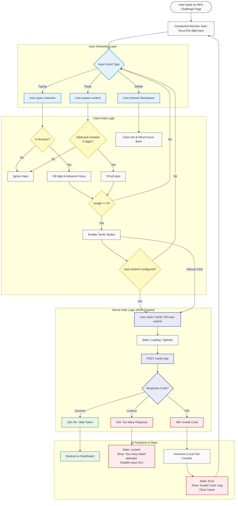

{
  "diagram_info": {
    "diagram_name": "MFA Verification Input Interaction Flow",
    "diagram_type": "flowchart",
    "purpose": "Documents the detailed user interaction logic, validation states, and error handling for the MFA OTP input component during the login process.",
    "target_audience": [
      "Frontend Developers",
      "UX Designers",
      "QA Engineers"
    ],
    "complexity_level": "medium",
    "estimated_review_time": "5 minutes"
  },
  "diagram_elements": {
    "actors_systems": [
      "User",
      "MFA Input Component",
      "AWS Cognito Service",
      "Rate Limiter"
    ],
    "key_processes": [
      "Input Masking",
      "Auto-Focus",
      "Paste Handling",
      "TOTP Validation",
      "Account Lockout"
    ],
    "decision_points": [
      "Input Length == 6?",
      "Is Numeric?",
      "Paste Valid?",
      "Backend Validation Success?",
      "Max Attempts Exceeded?"
    ],
    "success_paths": [
      "Manual Entry -> Verify -> Dashboard",
      "Paste Code -> Auto Verify -> Dashboard"
    ],
    "error_scenarios": [
      "Invalid Character Entry",
      "Invalid TOTP Code",
      "Expired Code"
    ],
    "edge_cases_covered": [
      "Clipboard Paste",
      "Account Lockout (5 failed attempts)",
      "Network Failure"
    ]
  },
  "accessibility_considerations": {
    "alt_text": "Flowchart describing the behavior of the MFA input field, including keyboard navigation, error announcements via ARIA live regions, and focus management.",
    "color_independence": "State changes are indicated by text labels and shape changes in addition to color.",
    "screen_reader_friendly": "Includes specific ARIA state updates for invalid codes and lockout messages.",
    "print_compatibility": "High contrast rendering suitable for documentation exports."
  },
  "technical_specifications": {
    "mermaid_version": "10.0+",
    "responsive_behavior": "Vertical layout optimized for scrolling",
    "theme_compatibility": "Neutral colors with semantic highlighting for states",
    "performance_notes": "Client-side validation should be instantaneous; Backend validation < 250ms"
  },
  "usage_guidelines": {
    "when_to_reference": "When implementing the MFAVerificationInput component or designing the Auth screen UX.",
    "stakeholder_value": {
      "developers": "Logic for paste handling and input constraints",
      "designers": "Visual states for error feedback and loading",
      "product_managers": "Confirmation of security policies (lockout rules)",
      "QA_engineers": "Test cases for edge cases like pasting and rate limiting"
    },
    "maintenance_notes": "Update if MFA provider changes from AWS Cognito or if complexity rules change (e.g., 8 digits).",
    "integration_recommendations": "Link to US-009 and US-008 requirements."
  },
  "validation_checklist": [
    "✅ Paste functionality logic included",
    "✅ Rate limiting/Lockout path defined",
    "✅ Validation states (Client vs Server) clearly separated",
    "✅ Mermaid syntax validated",
    "✅ Success and Error paths clearly distinct"
  ]
}

---

# Mermaid Diagram

