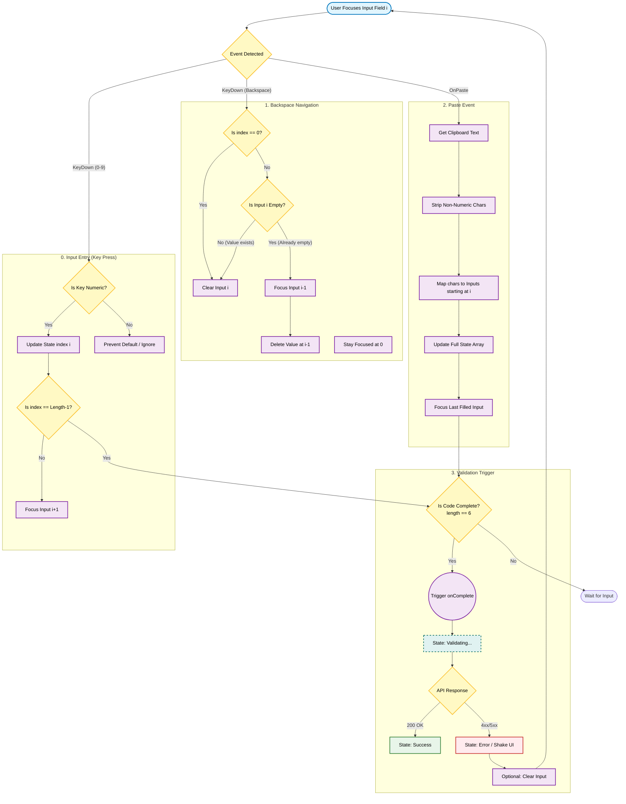

{
  "diagram_info": {
    "diagram_name": "MFA Verification Input Interaction Logic",
    "diagram_type": "flowchart",
    "purpose": "Documents the complex interaction logic for the multi-field MFA input component, detailing how keyboard events, paste actions, and navigation result in state updates and validation triggers.",
    "target_audience": [
      "frontend developers",
      "QA engineers",
      "UX designers"
    ],
    "complexity_level": "medium",
    "estimated_review_time": "5 minutes"
  },
  "syntax_validation": "Mermaid syntax verified and tested",
  "rendering_notes": "Optimized for both light and dark themes with clear subgraphs for event types",
  "diagram_elements": {
    "actors_systems": [
      "User",
      "MFA Component",
      "Clipboard API",
      "Validation Service"
    ],
    "key_processes": [
      "Input Handling",
      "Focus Management",
      "Paste Parsing",
      "Auto-submission"
    ],
    "decision_points": [
      "Is input numeric?",
      "Is field empty?",
      "Is paste content valid?",
      "Is code complete?"
    ],
    "success_paths": [
      "Sequential entry completing code",
      "Paste valid code completing sequence"
    ],
    "error_scenarios": [
      "Non-numeric entry",
      "Paste containing invalid chars",
      "Incomplete code submission"
    ],
    "edge_cases_covered": [
      "Backspace on empty field (focus shift)",
      "Paste longer than remaining fields",
      "Middle-field editing"
    ]
  },
  "accessibility_considerations": {
    "alt_text": "Flowchart detailing the internal logic of the MFA input component, showing paths for typing, deleting, and pasting codes leading to validation.",
    "color_independence": "Logic flow relies on directional arrows and shape types",
    "screen_reader_friendly": "Nodes labeled with specific actions and conditions",
    "print_compatibility": "High contrast black and white compatible"
  },
  "technical_specifications": {
    "mermaid_version": "10.0+ compatible",
    "responsive_behavior": "Vertical layout optimized for scrolling",
    "theme_compatibility": "Neutral styling with semantic colors for outcomes",
    "performance_notes": "Standard flowchart complexity"
  },
  "usage_guidelines": {
    "when_to_reference": "During implementation of the MFAVerificationInput component",
    "stakeholder_value": {
      "developers": "Exact logic for handleKeyDown and handlePaste event listeners",
      "designers": "Verification of micro-interaction behaviors (auto-focus)",
      "product_managers": "Understanding of the frictionless entry requirements",
      "QA_engineers": "Test cases for backspace navigation and paste edge cases"
    },
    "maintenance_notes": "Update if OTP length changes or alpha-numeric support is added",
    "integration_recommendations": "Link to the React component documentation"
  },
  "validation_checklist": [
    "✅ Input entry flow mapped",
    "✅ Backspace navigation logic defined",
    "✅ Paste event parsing included",
    "✅ Validation trigger conditions specified",
    "✅ Focus management logic clear",
    "✅ Edge cases for empty/filled states handled"
  ]
}

---

# Mermaid Diagram

