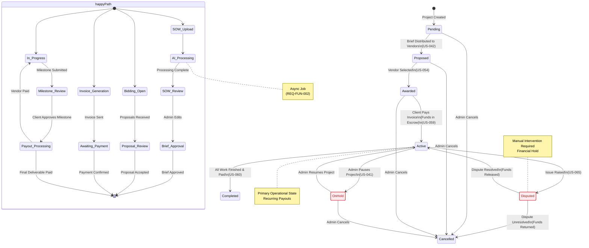

{
  "diagram_info": {
    "diagram_name": "Project Lifecycle State Machine",
    "diagram_type": "stateDiagram-v2",
    "purpose": "Documents the definitive state transitions for the core Project entity, including triggers, guard conditions, and side effects like financial events.",
    "target_audience": [
      "backend developers",
      "product managers",
      "QA engineers"
    ],
    "complexity_level": "medium",
    "estimated_review_time": "5 minutes"
  },
  "syntax_validation": "Mermaid stateDiagram-v2 syntax verified",
  "rendering_notes": "Optimized for vertical flow with clear separation of happy path and exception states",
  "diagram_elements": {
    "actors_systems": [
      "System Admin",
      "Client",
      "Vendor",
      "Payment Gateway"
    ],
    "key_processes": [
      "SOW Processing",
      "Vendor Matching",
      "Invoicing",
      "Dispute Resolution"
    ],
    "decision_points": [
      "Brief Approval",
      "Proposal Acceptance",
      "Payment Confirmation",
      "Dispute Resolution"
    ],
    "success_paths": [
      "Pending -> Proposed -> Awarded -> Active -> Completed"
    ],
    "error_scenarios": [
      "Cancellation at various stages",
      "Disputes requiring mediation"
    ],
    "edge_cases_covered": [
      "Reverting from On Hold",
      "Resolving Disputes"
    ]
  },
  "accessibility_considerations": {
    "alt_text": "State diagram showing the lifecycle of a project from Pending creation through Proposal and Active phases to Completion, including exception states like On Hold, Cancelled, and Disputed.",
    "color_independence": "States are differentiated by position and label, not just color",
    "screen_reader_friendly": "All transitions have clear text labels describing the trigger event",
    "print_compatibility": "High contrast lines and text suitable for black and white printing"
  },
  "technical_specifications": {
    "mermaid_version": "10.0+",
    "responsive_behavior": "Vertical layout fits standard documentation viewports",
    "theme_compatibility": "Neutral styling works with light/dark modes",
    "performance_notes": "Standard complexity, renders instantly"
  },
  "usage_guidelines": {
    "when_to_reference": "When implementing state transition logic in the Project Service or designing UI status indicators.",
    "stakeholder_value": {
      "developers": "Defines valid state transitions and triggers for the state machine implementation",
      "designers": "Maps necessary UI actions (buttons/modals) available in each state",
      "product_managers": "Visualizes the business process flow and constraints",
      "QA_engineers": "Provides a map for testing valid and invalid state transitions"
    },
    "maintenance_notes": "Update if new intermediate states (e.g., 'Draft') are introduced or if financial triggers change.",
    "integration_recommendations": "Include in the Project Service technical design document."
  },
  "validation_checklist": [
    "✅ Happy path (Pending to Completed) clearly defined",
    "✅ Financial triggers (Invoice Paid) included",
    "✅ Exception states (On Hold, Cancelled, Disputed) documented",
    "✅ Mermaid syntax validated",
    "✅ Correctly reflects requirements REQ-FUN-003 and US-041"
  ]
}

---

# Mermaid Diagram

